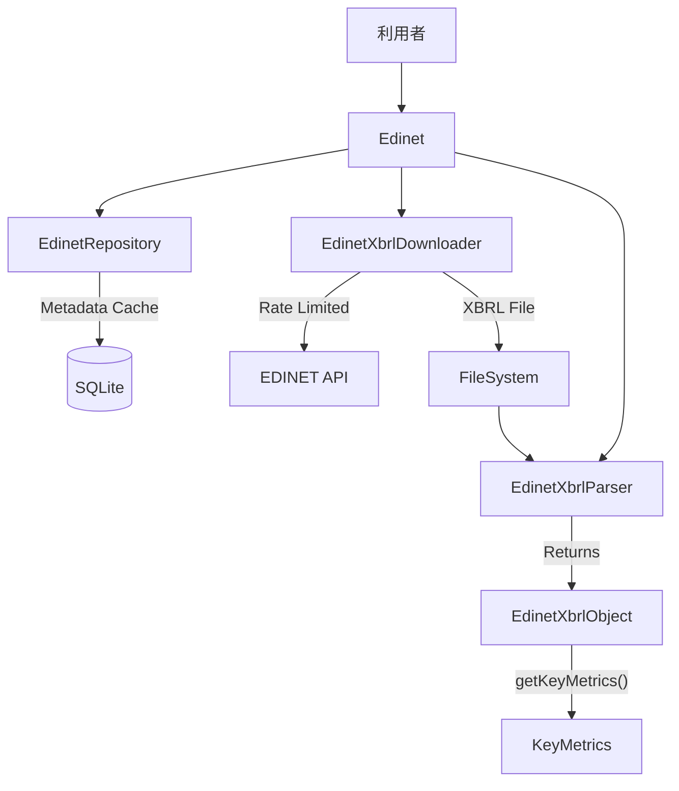

# 技術仕様書 (SPECIFICATIONS.md)

本ドキュメントでは、`edinet-ts` の内部アーキテクチャ、クラス設計、および主要なアルゴリズムについて記述します。開発者がライブラリの拡張やデバッグを行う際の参照資料とすることを目的とします。

## 1. ソフトウェア・アーキテクチャ

本ライブラリは、大きく分けて「ダウンロード層」と「解析層」の2層で構成されています。

## 2. クラス設計

### 2.0 `Edinet` (Facade)
ライブラリのエントリーポイントです。

*   **役割**: ユーザーに対する高レベルなAPIを提供し、`Downloader`、`Parser`、`Repository` を透過的に組み合わせます。
*   **ハイブリッド検索**: `findDocuments` 系メソッドでは、まずローカルDB (`EdinetRepository`) を検索し、ヒットしなければAPIにフォールバック、あるいは指定された期間のAPIデータを取得してDBを更新します。

### 2.1 `EdinetXbrlDownloader`
EDINET API v2 との通信を担当します。

*   **役割**: 書類一覧API (`/api/v2/documents.json`) から特定企業の最新書類（コード: 030000 など）を検索し、書類取得API (`/api/v2/documents/{docID}`) からZIPを取得します。
*   **ZIP処理**: `jszip` を使用し、アーカイブ内のファイル構成から `.xbrl` ファイルを探索します。
    *   **優先順位**: `PublicDoc` ディレクトリ内のXBRLを最優先とし、次にルートディレクトリ、サブディレクトリの順で探索します。これにより、監査報告書 (`AuditDoc`) などのノイズを除去します。
*   **認証**: APIキーを `Subscription-Key` ヘッダーまたはクエリパラメータとして付与します。
*   **レート制限**: `RateLimiter` により、APIへのリクエストを（デフォルトで）1秒間に1回以下に制限します。

### 2.2 `EdinetXbrlParser`
XBRLファイルの構文解析を担当します。

*   **依存ライブラリ**: `fast-xml-parser`
*   **Context解析**: データ読み込みの前に、まず `<xbrli:context>` 要素を走査し、`ContextParser` を用いてコンテキストIDと論理的意味（期間・範囲）のマッピングを作成します。
*   **データ解析**: XMLツリーを再帰的にトラバースし、数値データやテキストデータを抽出して `EdinetXbrlObject` に格納します。

### 2.3 `EdinetXbrlObject`
解析されたXBRLデータを保持するデータコンテナです。

*   **データ構造**:
    *   `dataMap`: `Map<Key, EdinetData[]>` - タグ名をキーとしたデータのリスト（同名タグが複数コンテキストで存在するため）。
    *   `contextMap`: `Map<ID, EdinetContext>` - コンテキストIDから定義情報（期間、連結/単体区分）へのマップ。
*   **検索ロジック (`findContext`)**:
    *   指定された条件（Type: `Duration`/`Instant`, Scope: `Consolidated`/`NonConsolidated`）に合致するコンテキストIDを `contextMap` から検索します。
    *   複数の候補がある場合、日付が最も新しいものを「当期」とみなして返します。

### 2.4 `EdinetDataUtil`
XMLノードから属性や値を安全に取り出すためのユーティリティです。

*   **役割**: `unknown` 型のノードに対して Type Guard を適用し、安全に `.text` や属性値 (`@_contextRef`) を取得します。
*   **名前空間**: タグ名に含まれる名前空間プレフィックス（`jppfs_cor:` 等）はそのまま保持しますが、値の取得時には構造の違いを吸収します。

### 2.5 `EdinetRepository` (SQLite)
メタデータ管理を担当します。

*   **技術スタック**: `better-sqlite3` を使用。
*   **スキーマ (edinet.db)**:
    *   `documents`: 書類管理ID、提出者名、書類種別、提出日時などを格納。
    *   `filers`: EDINETコードと提出者名のマッピング（将来拡張用）。
*   **役割**: 過去の日付指定検索を高速化し、APIの負荷を軽減します。
    *   **導入の経緯**: EDINET API v2 は「日付指定」の検索には適していますが、「特定企業の過去5年分」といった**ティッカーベースの時系列検索**を直接行うAPIが存在しません。
    *   そのため、過去の提出書類リスト（メタデータ）をローカルDBに蓄積し、インデックスを貼ることで、`get -t 7203` のようなティッカー検索を数ミリ秒で実行可能にしました。また、都度APIを全走査する必要がなくなるため、APIサーバーへの負荷（レート制限）も大幅に削減されます。

## 3. 主要アルゴリズム

### 3.1 コンテキスト判定ロジック
XBRLの `xbrli:context` 要素を以下のように解析します。

1.  **期間 (`xbrli:period`)**:
    *   `startDate` / `endDate` があれば `Duration` (フロー項目用)
    *   `instant` があれば `Instant` (ストック項目用)
2.  **範囲 (`xbrli:scenario` / `xbrli:segment`)**:
    *   `xbrldi:explicitMember` に `NonConsolidatedMember` が含まれていれば `NonConsolidated` (単体)。
    *   それ以外はデフォルトで `Consolidated` (連結) とみなします（※EDINETの慣習に基づく）。

### 3.2 主要指標抽出ロジック (`getKeyMetrics`)

#### 金額・キャッシュフロー: 探索範囲を固定する

対象は `netSales`、`operatingIncome`、`ordinaryIncome`、`netIncome`、`netAssets`、`totalAssets`、`operatingCashFlow`、`investingCashFlow`、`financingCashFlow`、`cashAndEquivalents` です。

1. `Duration`（期間）と `Instant`（時点）を独立に処理します。`findContexts` の既存条件に従い、連結は次元なし、単体は `NonConsolidatedMember` のみのコンテキストを対象にします。セグメント等の追加次元は対象外です。
2. `FilingDateInstant` は提出日メタデータなので、この探索範囲の判定・期間の基準から除外します。単体財務諸表と提出日コンテキストだけの書類で、提出日を理由に単体値を取りこぼさないためです。`findContexts` 自体の動作は変更しません。
3. 連結の対象コンテキストがあれば連結グループ内に固定し、なければ単体グループを使います。選んだグループの最新日から **180日未満** の候補を新しい順に探索し、各コンテキストで既存のタグ候補を順に試します。連結の対象タグが欠落・空・数値変換不能であっても、単体に移りません。値 `0` は有効です。
4. 選択した範囲の候補を使い切ったら `undefined` を返します。日付フィルタで候補が空になった場合も、単体や固定IDで探索し直しません。
5. どちらの対象コンテキストも見つからない場合は、定義を追加せず `put()` していた利用方法の互換性のため、`CurrentYearDuration` / `CurrentYearInstant` とその `_NonConsolidatedMember` を順に調べます。**定義がなく、何らかの実データが参照する最初のID** に範囲を固定します。連結IDに対象外のタグしかなくても単体へ落としません。既知の定義が次元・期間条件で除外された場合、固定IDを使ってその定義を復活させません。

目的は、連結値を取得できないときに単体値を混ぜて返すことを防ぐことです。対象タグを増やしたり、未知のタグを推測して値を埋めたりする変更ではありません。

#### 互換性を維持する指標

`earningsPerShare`、`bookValuePerShare`、`equityToTotalAssetsRatio`、`rateOfReturnOnEquity`、`priceEarningsRatio`、`payoutRatio`、`numberOfIssuedShares`、`dividendPaidPerShare` は、従来どおり連結→単体→固定IDのフラット探索を維持します。特に発行済株式数や配当など、既存fixtureでは単体コンテキストから取得する項目があるためです。これらすべてが会計上単体へのフォールバックで適切であると一般化するものではなく、今回の修正範囲を金額・CFに絞るための互換性判断です。

このため、`KeyMetrics` 全項目が同じ連結区分・期間にそろう保証はありません。同じ区分・期間の厳密な比較には、`getDataByContextRef()` 等で明示的に指定してください。

#### 検証根拠と制限

- 参考: 未マージで閉じられた [PR #14](https://github.com/oharato/edinet-ts/pull/14) の問題報告。今回の変更に同PRのワークフロー・バージョン・ダウンローダー変更は含めません。
- 同梱の `test/test_data/CI_4689_yahoo.xbrl` を確認すると、`185012000000` は `CurrentYearDuration_NonConsolidatedMember` の `jppfs_cor:OperatingIncome` です。一方、`CurrentYearDuration` の `OperatingIncomeIFRSSummaryOfBusinessResults` は企業拡張名前空間で、値は `192049000000` です。既存の標準タグ候補には一致しないため、`getKeyMetrics().operatingIncome` は `undefined` とします。fixtureの生データ確認を回帰テストに含めます。
- 同梱12 XBRL（監査書類含む）の修正前後比較では、変更はYahooの営業利益・経常利益と、SoftBank Groupの営業利益・経常利益の4項目でした。Yahooの経常利益 `187449000000`、SoftBank Groupの営業利益 `-42808000000`・経常利益 `-1161224000000` も `CurrentYearDuration_NonConsolidatedMember` の値であり、これらを `undefined` にします。他の指標は比較時に不変でした。
- 上記はリポジトリ内fixtureの検証です。提出書類原本との独立照合やトヨタ等の追加実データの検証を実施したことを意味しません。
- 連結判定は既存の次元・期間情報に依存します。次元なしを連結とみなす慣習、明示次元以外の分類、任意の名前のメタデータコンテキスト、過去連結／現在単体への移行、年度／四半期／累計の厳密な対応は再設計していません。`FilingDateInstant` 以外のメタデータ識別や、未知の企業拡張タグの会計上の意味の判定は対象外です。
- コンテキストとタグの優先順位、数値変換、各指標のタグ候補、`getData()` やタクソノミのプロキシは今回変更しません。
- `test/key-metrics-scope.test.ts` では期間／時点、単体のみ、ゼロ、代替タグ、複数候補、180日の境界、無効値・日付、追加次元、提出日メタデータ、固定ID、互換指標を検証します。既存のYahoo・Raccoon・Kakaku.comのfixtureテストも併せて実行します。

### 3.3 ファイル探索ロジック (`findXbrlFileInDir`)
ダウンロードしたZIPには複数のXBRLが含まれる場合があります（例：監査報告書）。
財務データを正しく抽出するため、以下の優先順位で解析対象ファイルを決定します。

1.  ファイル名が `.xbrl` で終わり、かつパスに `PublicDoc` を含むものを最優先。
2.  カレントディレクトリにある `.xbrl`。
3.  サブディレクトリを再帰的に探索（ここでも `PublicDoc` ディレクトリを優先的に探索）。

